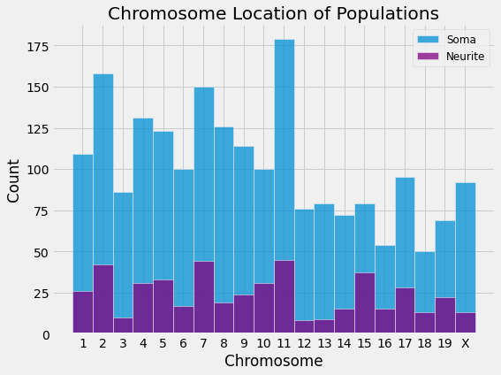
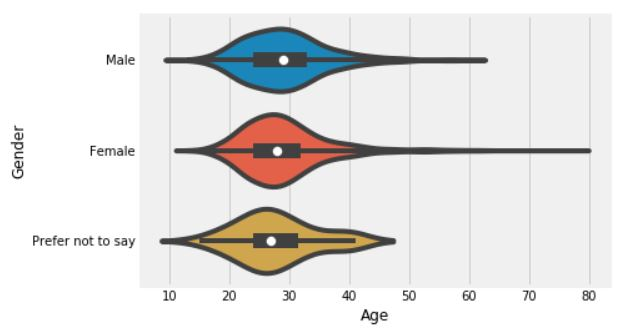
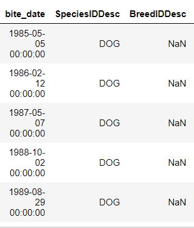

## Projects Currently Focusing on 

* Python 3.0 
* Pandas/Numpy
* Matplotlib/Seaborn
* SciKitlearn 
* SQL

## Previous Projects

* R (statistics and RNA) 
* Perl (Genomics and DNA alignment) 

---

### [RNA Regulation through Localization- from zipcodes to mass transit](https://github.com/RebeccaOC/SynapticRNA_Regulation) 

Predicting sub-cellular location (synaptic vs cell body) of translating RNAs in excitatory neurons of the cortex 
 
  * Single Factor Correlations
  * Decision Tree
  * Random Forest
  
 

 
 

  

---

### [Challenge Participation- what determines a program's success](https://github.com/RebeccaOC/Program_Success)

Identification of factors predicting the retention of individuals in a multiweek challenge to weekly log their activity and weight.

  * Analysis of Population Demographics 
  * Analysis of Team Demographics
  * Factors correlated with non-participation and retention
  * Analysis of challenge outcome and success 
  
 

 
 

  

----

### [Dog Bites- why reporting bias and null data matters in datasets](https://github.com/RebeccaOC/Dog_Bites)

Looking further into how dog bites are reported and if any dog breed is over-represented (answer: no) 

  * Cleaning of public datasets 
  * Determining information from NULL inputs 
  * Importance of educating those outside of data science about proper data collection
 
 

 
 

 
 ---
  
